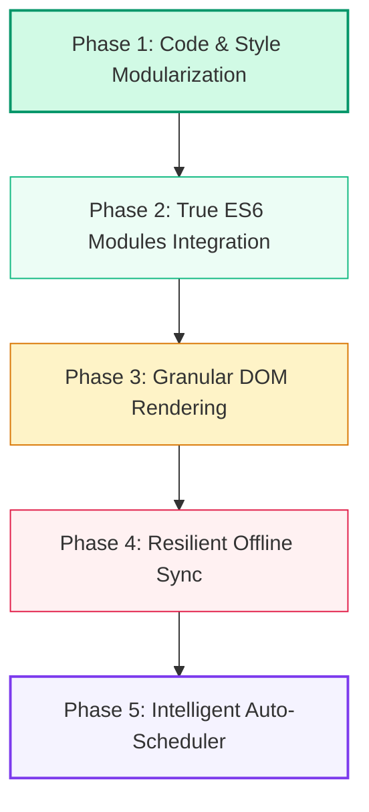

# Project Improvement Roadmap: Simple to Complex

This document outlines the planned improvement phases for the **Class Program Scheduler** to transition it from a monolithic front-end structure into a modular, highly performant, and intelligent application.

---

## 🟢 Phase 1: Code & Style Modularization (Simple)
**Goal:** Clean up the HTML structure and link modularized assets.

*   **Move Inline Styles:** Extract the 130+ lines of CSS from `<style>` inside `index.html` and consolidate them into the external `src/styles.css` file.
*   **Link External Stylesheet:** Add `<link rel="stylesheet" href="src/styles.css">` to `index.html`.
*   **Remove Unused Code:** Remove redundant files or leftover refactoring scripts that clutter the workspace.

---

## 🟡 Phase 2: True ES6 Module Architecture (Medium)
**Goal:** Migrate the scripts from the global `window` namespace to modular ES6 exports/imports.

### ✅ Phase 2a — Completed
*   **External Firebase Module:** Moved the 56-line inline `<script type="module">` Firebase bootstrap from `index.html` into `src/firebase-init.js`.
*   **Convert Simple Scripts:** Converted `src/ui-handlers.js` and `src/saved-schedules.js` from `defer` to `type="module"` script tags — they only set `window.*` functions so they are fully compatible.
*   **Link External Stylesheet:** Done in Phase 1.

### ✅ Phase 2b — Completed
*   **Rewrite `src/state.js`:** Converted from a 518-line plain `defer` script to a proper ES6 module. Uses `Object.defineProperty` getters/setters on `window` to keep `State.workspace`, `State.draggedBlockId`, and all other state properties in sync with `app.js`'s bare global variable references — meaning **`app.js` needed zero changes**. Exports `State`, `saveState`, `loadState`, `switchClassProgram`, `switchSchoolYear`, `getAllSchoolYears`, `registerSchoolYear`. Also exposes `migrateLegacyData` on `window` since `app.js` calls it directly.

### 🔲 Phase 2c — Remaining (Retire app.js Monolith)
*   **Migrate missing features into `src/ui.js`:** `src/ui.js` is the fully-modular replacement for `app.js` but is currently missing `handleAuthAction`, `openNewSYModal`, `createNewSchoolYear`, and teacher modal handling from `app.js`. These must be migrated before `app.js` can be retired.
*   **Make `src/ui.js` the entry point:** Once features are migrated, switch `index.html` from `<script defer src="src/app.js">` to `<script type="module" src="src/ui.js">`.
*   **Remove `src/app.js`:** After verifying `ui.js` is feature-complete, delete the 4000-line monolith.

---

## 🟠 Phase 3: Granular DOM Rendering (Medium-Complex)
**Goal:** Improve interface performance and eliminate layout lag during drag-and-drop actions.

*   **Avoid Full Redraws:** Currently, calling `renderAll()` completely resets and redraws large chunks of the workspace DOM via `innerHTML` whenever a card is moved.
*   **Targeted DOM Updates:** Rewrite the rendering functions to target specific nodes. For example, moving a subject card should only re-render the source cell, the target cell, the specific teacher's summary workload item, and the diagnostics console.

---

## 🔴 Phase 4: Resilient Offline-to-Online Cloud Sync (Complex)
**Goal:** Enable seamless collaboration by resolving conflicts that occur when editing offline.

*   **State Conflict Strategy:** Cache local changes during network disconnects.
*   **Sync Resolution Dialog:** When coming back online, detect if remote changes exist. Provide a visual merge interface to let users pick between local overwrites, remote overwrites, or a side-by-side merge.

---

## 🟣 Phase 5: Intelligent Auto-Scheduling & Suggestions (Advanced)
**Goal:** Introduce smart automation to solve schedule constraints automatically.

*   **Smart Conflict Resolver:** In addition to listing conflicts, display helper buttons next to warnings. Clicking "Suggest Alternative" will scan for available time slots or teachers that won't violate rules.
*   **Backtracking Auto-Scheduler:** Implement a constraint satisfaction engine. The user specifies desired subjects, section allocations, and teacher workloads, and the scheduler outputs a fully-allocated, conflict-free matrix draft.
